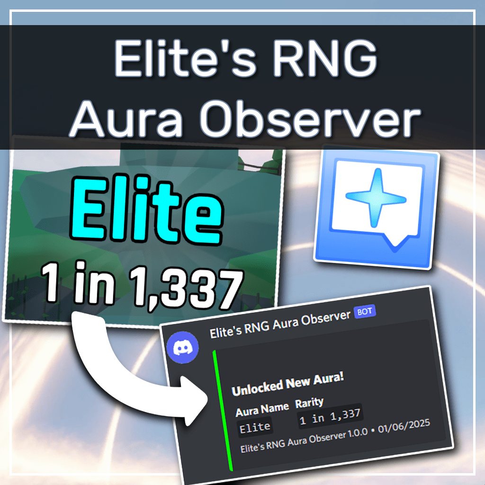

# Elite's RNG Aura Observer

[English](README.md) | [日本語](README-ja.md)

[Elite's RNG Land](https://vrchat.com/home/world/wrld_50a4de63-927a-4d7e-b322-13d715176ef1) で Aura を獲得したときに、Windows トースト通知と Discord Webhook で通知します。

## ✨ 特徴

- VRChat のログファイルを監視し、Aura 獲得時のログが検出されたときに通知
- AFK 時や外出先でも、Aura を獲得したことを瞬時に把握できる
- Elite's RNG Land で演出がある Aura のみに通知対象を絞っているため、重要な Aura のみを気づける
- タスクトレイにてバックグラウンド実行されるため、邪魔にならない
- 自動アップデートツールを同梱。アップデートがある場合はユーザーの操作が必要なく自動的にアップデート
- 設定ファイルを編集する必要なく、設定ウィンドウで各種設定が可能

## 🚀 インストール手順

本アプリケーションのインストール手順は、以下のページで解説しています。

- [実行ファイル (exe) によるポータブルインストール](docs/ja/installation/portable-install.md)

## 🎁 寄付

このプロジェクトでは、寄付を受け付けています。以下の方法で寄付が可能です。

- [Booth](https://tomachi.booth.pm/items/6969815)
- GitHub Sponsor: [@book000](https://github.com/sponsors/book000)

## 📑 ライセンス

このプロジェクトのライセンスは [MIT License](LICENSE) です。
